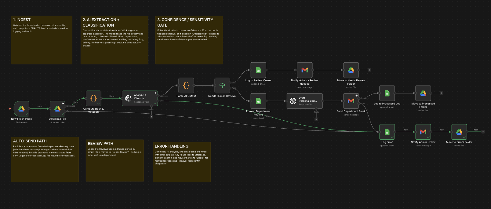

# AI Document Intake, Classification & Routing System

End-to-end AI document automation that ingests inbound files from Google Drive, classifies them with a multimodal LLM using a strict JSON schema, applies a confidence/sensitivity gate, and dynamically routes each document to an automated email, a human review queue, or an error-escalation path.

Personal project — active proof of concept.

---

## Project Documentation

- [View Project Case Study (PDF)](https://docs.google.com/document/d/1JmkaOVEekW8rQ6Mnms0hFY1tYzvEC8OvatFBk0yS3xo/edit?usp=sharing)
- [Workflow Export (n8n JSON)](./AI_Document_Automation_workflow.json)

---

## Project Overview

This automation replaces a manual "read it, decide who it's for, reply, file it" document intake process by:

- Watching a Google Drive Inbox folder for newly uploaded files
- Classifying each document with a multimodal AI model that reads the file directly (no separate OCR step)
- Enforcing a strict JSON schema on the AI output: department, confidence, summary, key entities, sensitivity flag, priority
- Gating low-confidence, ambiguous, or sensitive documents into a human review queue instead of auto-routing them
- Drafting a grounded, department-appropriate notification email for clear-cut cases
- Logging every outcome to Google Sheets and filing the source document accordingly

The system demonstrates AI-driven document understanding combined with deterministic safety logic, not just "AI makes the call."

---

## Business Problem

Handling inbound documents manually requires:

- Reading and classifying every document by hand
- Deciding which department or team should receive it
- Drafting an appropriate response
- Watching for sensitive content that shouldn't be routed without a human check
- Tracking every document through to completion

Manual handling is slow, inconsistent across reviewers, and creates real risk when sensitive information (PII, compensation data, legal disputes) gets routed without anyone checking it first.

---

## Solution Summary

The automation system consists of:

1. n8n — orchestrates the full intake-to-routing workflow
2. Google Drive — file trigger, download, and folder-based state machine (Inbox / Processed / Needs Review / Errors)
3. OpenAI multimodal GPT — classifies the document directly from the file and returns strict, schema-validated JSON
4. Confidence/sensitivity gate — deterministic logic that decides auto-send vs. human review vs. error
5. OpenAI GPT (second call) — drafts the outbound notification email using only already-extracted facts
6. Google Sheets — structured logging plus an editable department routing table
7. Gmail — sends the automated notification and admin error alerts

---

## Tech Stack

- n8n — workflow orchestration
- OpenAI multimodal GPT — document classification and email drafting
- OpenAI structured outputs — strict JSON schema enforcement
- Google Drive API — triggers, downloads, folder-based routing
- Google Sheets API — structured logging and editable routing table
- Gmail API — automated notifications and error alerts
- SHA-256 hashing — file-level audit trail

---

## Workflow Architecture

Drive Trigger → Download + Hash → AI Classification → Confidence/Sensitivity Gate → Routing Lookup → AI Email Drafting → Multi-Channel Execution (Gmail + Sheets + Drive) → Error Handling (workflow-wide)

1. Drive Trigger watches the Inbox folder for newly created files
2. File is downloaded and a SHA-256 hash + metadata is computed for audit
3. One multimodal GPT call classifies the document and returns strict JSON (department, confidence, summary, key entities, sensitivity flag, priority)
4. Confidence/sensitivity gate: anything under 75% confidence, flagged sensitive, unparsable, or "Unclassified" goes to human review instead of being auto-sent
5. Department routing lookup pulls the correct recipient and tone from an editable Google Sheets table
6. A second GPT call drafts a short, fact-grounded notification email
7. Email sent via Gmail, record logged to Google Sheets, file moved to the matching Drive folder
8. Any node failure anywhere is caught, logged to an Errors sheet, the admin is alerted by email, and the file is moved to an Errors folder

---

## Full Workflow Canvas

---

## Key Outcomes

- Fully automated document classification and routing with zero manual triage for high-confidence cases
- Built-in safety net — sensitive or low-confidence documents are never auto-routed, only ever queued for human review
- Single multimodal AI call replaces a traditional OCR-engine + classifier pipeline
- Editable routing logic (recipients/tone) that doesn't require touching the workflow
- Workflow-wide error handling — every failure is caught, logged, and escalated, nothing fails silently

---

## Skills Demonstrated

- Multimodal AI document understanding with strict structured-output enforcement
- Confidence-gated automation design — deterministic safety logic layered on top of probabilistic AI output
- Multi-system workflow orchestration (Drive, Sheets, Gmail, OpenAI) in a single automated pipeline
- Production-style error handling and operational logging
