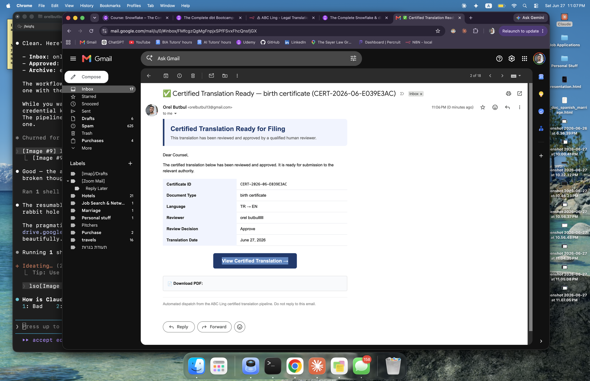
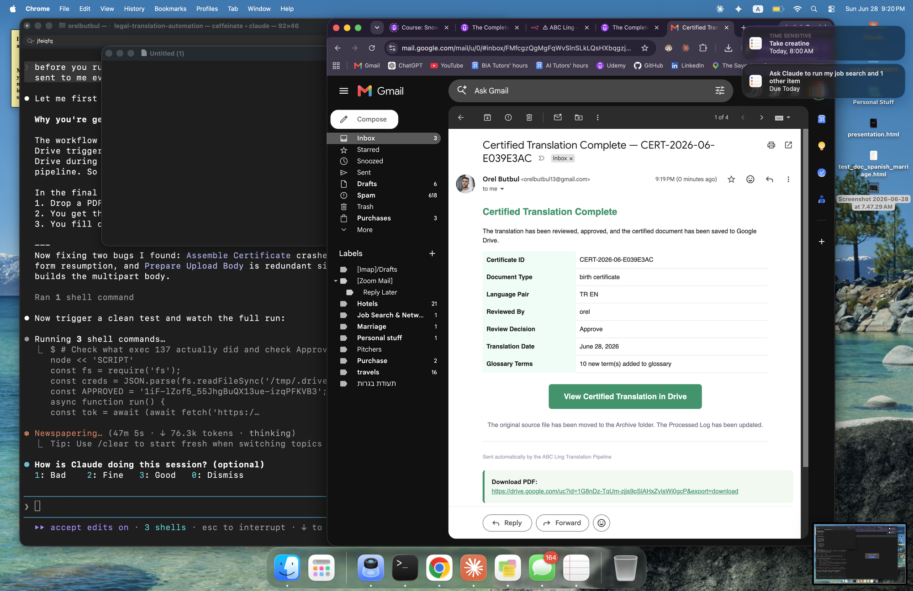

# AI Legal Document Translation Pipeline

End-to-end automation for certified legal document translation — built in n8n with GPT-4o Vision, PII tokenization, glossary-aware AI translation, human-in-the-loop review, and automated Google Doc delivery.

Client project — US-based certified legal translation firm (NDA).

---

## Project Documentation

- [View Presentation](./presentation.html)
- [View Technical Reference](./demo.html)
- [Workflow Export (n8n JSON)](./workflow/workflow.json)

---

## Project Overview

This automation replaces a manual certified translation process by:

- Watching a Google Drive Inbox folder for newly uploaded legal documents
- Extracting all text from scanned PDFs using GPT-4o Vision, preserving reading order and flagging stamps, seals, and handwritten annotations
- Detecting and tokenizing all PII (names, addresses, ID numbers, dates) before any translation call — the AI model never sees real client identities
- Looking up known legal term pairs from a glossary, injecting them into the translation prompt, and saving any new terms discovered back to the glossary automatically
- Pausing execution at a built-in human review step — a certified reviewer approves, edits, or rejects via form before any certified document is produced
- Assembling the approved translation into a formatted Google Doc with certificate metadata (ID, language pair, reviewer, date) and delivering it by email

---

## Business Problem

Certified legal translation firms handle documents that are:

- **Language-sensitive** — courts reject translations that are inaccurate, summarized, or inconsistent in legal terminology
- **Terminology-critical** — a case may involve 10+ documents; the same legal phrase must be translated identically across all of them
- **Privacy-sensitive** — sending client documents containing full names, passport numbers, and home addresses to third-party AI services creates compliance and confidentiality risk
- **Accountability-required** — no certified translation document can be produced without a qualified human approving it; fully automated output is not legally valid

Manual handling is slow, prone to terminology drift across documents, and creates real privacy risk when raw client documents are processed without a data protection layer.

---

## Solution Summary

The pipeline consists of seven stages:

1. **n8n** — orchestrates the full pipeline with conditional routing, error handling, and a native Wait node for human review suspension
2. **Google Drive** — document intake (Inbox), in-progress tracking (Processing), certified output (Approved), and source archiving (Archive)
3. **GPT-4o Vision** — reads the scanned document image directly, extracts text per page, flags special elements (stamps, seals, handwritten notes)
4. **PII Tokenization** — GPT-4o detects identifiable data, a Code node replaces each instance with a stable placeholder token; the token map is held only in execution memory and is never written to any file or sheet
5. **Glossary-Aware Translation** — Google Sheets glossary is read before each translation call; known legal term pairs are injected into the prompt; new terms found during translation are saved back automatically
6. **Human Review** — n8n Wait node fully suspends execution; reviewer receives an email with flagged translation terms, opens a form, and approves, edits, or rejects; pipeline resumes on form submission
7. **Document Assembly and Delivery** — a Code node builds an HTML certificate; a Drive API multipart upload converts it to a native Google Doc; completion email with doc link is sent

---

## Tech Stack

- n8n — workflow orchestration (self-hosted)
- OpenAI GPT-4o Vision — OCR text extraction from scanned documents
- OpenAI GPT-4o — PII detection, legal translation with glossary injection
- Google Drive API — document intake, multipart upload for Google Doc creation
- Google Sheets API — glossary management and processed document log
- Gmail API — reviewer notifications and completion delivery
- JavaScript (n8n Code nodes) — PII tokenization, detokenization, certificate assembly

**Why n8n:** Self-hosted — all client documents stay on local infrastructure. No per-execution licensing cost at scale. Visual workflow canvas is auditable by non-technical stakeholders.

---

## The Three AI Prompts

**Prompt 1 — Document Reading (OCR)**
Sent to GPT-4o Vision with the scanned document image. Instructs the model to extract text top-to-bottom in reading order, detect page boundaries, and explicitly flag stamps, seals, and handwritten annotations — not silently drop them. Returns structured JSON per page. Language-agnostic: works on any source language.

**Prompt 2 — PII Detection**
Sent on extracted text before any translation call. Identifies every name, address, phone number, ID number, date of birth, and case number. Returns a structured entity list with a stable sequential token for each value — the same name always receives the same token across all pages. A Code node then does the actual substitution; the map lives only in execution memory.

**Prompt 3 — Legal Translation**
Sent on tokenized text with glossary term pairs injected. Instructs the model to produce a complete translation (never summarize or omit), preserve all placeholder tokens verbatim, use formal legal register, follow required glossary terms exactly, and flag any term where no established legal equivalent exists. Returns translated pages, flagged terms, and any new glossary terms to be saved.

---

## Workflow Architecture

```
Drive Trigger → Download + Hash Check → Move to Processing
→ GPT-4o Vision OCR → Parse Output
→ GPT-4o PII Detection → Parse Output → Tokenize (Code)
→ Glossary Lookup → Build Translation Input → GPT-4o Translation
→ Parse Output → Save New Glossary Terms
→ Detokenize (Code) → Send Review Notification → Wait Node (Human Review)
→ Apply Review Decision → Approved?
  → YES: Assemble Certificate → Drive API Upload → Log + Archive → Send Completion Email
  → NO:  Move to Needs-Review Folder → Notify Team
  → ANY FAILURE: Log Error → Notify Admin → Move to Errors Folder
```

---

## Pipeline Screenshots

**Review notification email — pipeline paused, reviewer decision required**



**Completion email — certified translation delivered**



**n8n workflow canvas — full pipeline**


---

## Challenges Solved

| Problem | Root Cause | Fix Applied |
|---|---|---|
| Google Doc opened empty — "No preview available" | Extra `\r\n` in multipart MIME boundary broke Drive API parsing; created 0-byte unnamed file | Switched to binary Buffer; set Content-Type via binary field mimeType so n8n passes it correctly |
| Completion email showed N/A for all reviewer fields | After Move to Archive node, output is Drive metadata — all pipeline data was lost | Added Restore Pipeline Code node that re-reads from Merge node using `$()` reference before email fires |
| Crash: "Cannot read .slice of undefined" | `fileHash.slice(0,8)` called when hash was undefined after form data failed to carry pipeline state | Changed to `(fileHash \|\| 'NOCERT').slice(0,8)` with null-safe fallback |
| Drive trigger never detected files after workflow restart | Reactivating workflow resets trigger checkpoint to "now" — files already in Inbox become invisible | Manually set `staticData.lastTimeChecked` via n8n REST API to a timestamp before the upload |
| `$helpers` not available inside Code nodes | n8n Code nodes run in an external task runner where `$helpers` is not defined | Replaced Code node Drive API call with dedicated HTTP Request node using predefined OAuth2 credential |

---

## Key Outcomes

- Full pipeline from scanned PDF to certified Google Doc with zero manual steps in the standard approval path
- Client PII never exposed to the translation model — enforced by architecture, not by policy or configuration
- Glossary compounds in quality with every document processed — terminology consistency enforced automatically across case files
- Any language pair supported — source language auto-detected by OCR prompt; target language passed as a parameter
- Workflow-wide error handling — every failure is caught, logged to sheet, escalated by email, and source file preserved for recovery

---

## Skills Demonstrated

- Privacy-preserving AI pipeline design — PII tokenization layer between OCR and translation with in-memory-only token map
- Prompt engineering for legal domain — structured output enforcement, formal register constraints, glossary injection, uncertainty flagging
- Multi-model AI orchestration — GPT-4o Vision for OCR, GPT-4o text for PII detection and translation, three isolated prompt stages
- Human-in-the-loop workflow architecture using n8n Wait node — execution suspension without compute cost
- Google Drive API multipart upload — HTML-to-Google-Doc conversion with correct MIME boundary construction
- Workflow-wide error handling and operational logging across all failure points
