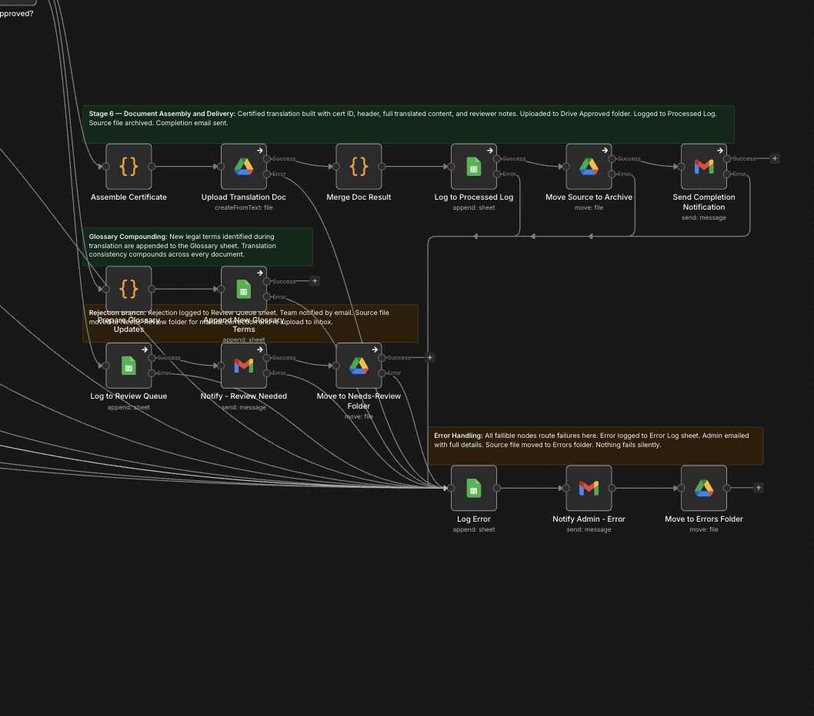

# AI Legal Document Translation Pipeline

End-to-end automation for certified legal document translation built in n8n with GPT-4o Vision, PII tokenization, glossary-aware AI translation, human-in-the-loop review, and automated Google Doc delivery.

Client project for a US-based certified legal translation firm (NDA).

**[→ View Live Project Page](https://orelbutbul13.github.io/Ai-Automation-Portfolio/AI-Legal-Document-Translation-Pipeline/demo.html)** — full pipeline walkthrough: architecture, all 3 AI prompts, bug table, business analysis, and real pipeline output screenshots

**[→ View Case Study](https://docs.google.com/document/d/16NSTzLTynZVfyxZReohpFcyNgvYT1bg8Ncot4laQRlk/edit)** — full written case study including all project links, privacy architecture decision, and outcomes

## Overview

This pipeline replaces a manual certified translation process. A scanned legal document arrives in a Google Drive folder. GPT-4o Vision extracts the text. A PII detection step replaces all client names, addresses, and ID numbers with placeholder tokens before any translation call, so the AI model never sees real client identities. The tokenized text is translated in formal legal register using a glossary of known term pairs, which grows with every document processed. Execution then pauses at a human review step — a certified reviewer approves, edits, or rejects the translation via a form before any certified document is produced. On approval, the translation is assembled into a formatted Google Doc with certificate metadata and delivered by email.

## Business Problem

Certified legal translation firms handle documents that demand accuracy at a level where a single inconsistent term can cause a court filing to be rejected. A case may span 10 or more documents — a divorce decree, death certificate, marriage certificate, bank statements — and every one must use identical legal terminology. Manual translation is slow, inconsistency across translators is a real risk, and sending raw client documents containing passport numbers and home addresses to third-party AI services raises serious compliance concerns. This pipeline addresses all three.

## Pipeline Architecture



```
Drive Trigger → Download → Hash Check → Move to Processing
→ GPT-4o Vision OCR → Parse Output
→ GPT-4o PII Detection → Parse Output → Tokenize
→ Glossary Lookup → Build Translation Input → GPT-4o Translation
→ Parse Output → Save New Glossary Terms
→ Detokenize → Send Review Notification → Wait Node
→ Apply Review Decision
    Approved  → Assemble Certificate → Drive Upload → Log + Archive → Send Completion Email
    Rejected  → Move to Needs-Review → Notify Team
    Any error → Log to Sheet → Notify Admin → Move to Errors Folder
```

The pipeline has three visual sections in n8n. The top row is the seven-stage happy path. The right section handles the reviewer reject and retranslate loop. The bottom row is the error branch that every node routes to on failure.

## The Three AI Prompts

**Prompt 1 — Document Reading**
Sent to GPT-4o Vision with the scanned document image. Instructs the model to extract all text in reading order, detect page boundaries, and explicitly flag stamps, seals, and handwritten annotations rather than silently dropping them. Returns structured JSON per page. Works on any source language without configuration changes.

**Prompt 2 — PII Detection**
Sent on the extracted text before any translation call. Identifies every name, address, phone number, ID number, date of birth, and case number. Returns a structured entity list with a stable sequential token assigned to each value. The same name always receives the same token across all pages. A Code node performs the actual substitution and the token map lives only in execution memory, never written to any file or log.

**Prompt 3 — Legal Translation**
Sent on the tokenized text with glossary term pairs injected. Instructs the model to produce a complete translation without summarizing or omitting anything, preserve all placeholder tokens verbatim, use formal legal register appropriate for court filings, follow the injected glossary terms exactly, and flag any term where no established legal equivalent exists. Returns the translated pages, a list of flagged terms, and any new glossary terms to be saved back to the sheet.

## Tech Stack

| Layer | Tool |
|---|---|
| Orchestration | n8n (self-hosted) |
| OCR | OpenAI GPT-4o Vision |
| PII Detection and Translation | OpenAI GPT-4o |
| Document Intake and Output | Google Drive API |
| Glossary and Logs | Google Sheets API |
| Notifications | Gmail API |
| Token Logic and Assembly | JavaScript (n8n Code nodes) |

Self-hosted n8n means all client documents stay on local infrastructure with no per-execution cost at scale. The visual workflow canvas makes every step auditable without reading code.

## Pipeline Screenshots

**[→ View Review Email Screenshot](screenshots/review-email-v2.png)** — pipeline paused waiting for human decision

**[→ View Completion Email Screenshot](screenshots/completion-email-v2.png)** — certified translation approved and delivered

## Challenges Solved

| Problem | Root Cause | Fix |
|---|---|---|
| Google Doc opened empty | Extra line break in multipart MIME boundary broke Drive API parsing, creating a 0-byte unnamed file | Switched from raw string body to binary Buffer; n8n reads the mimeType from the binary field automatically |
| Completion email showed N/A for all reviewer fields | After Move to Archive, the node output is Drive metadata and all pipeline data was lost | Added a Restore Pipeline Code node that re-reads from the earlier Merge node using a $() reference |
| Crash on certificate assembly | fileHash.slice(0,8) threw when hash was undefined after the review form failed to carry pipeline state | Changed to (fileHash \|\| 'NOCERT').slice(0,8) |
| Drive trigger ignored files after workflow restart | Reactivating the workflow resets the trigger checkpoint to now, making files already in the Inbox invisible | Set staticData.lastTimeChecked via the n8n REST API to a time before the upload |
| $helpers unavailable in Code nodes | n8n Code nodes run in an external task runner where $helpers is not defined | Replaced the Code node API call with a dedicated HTTP Request node using predefined OAuth2 credential |

## Key Outcomes

Full pipeline from scanned PDF to certified Google Doc with zero manual steps in the standard approval path. Client PII is never exposed to the translation model, enforced by the architecture rather than by trust or policy. The glossary compounds in quality with every document processed, automatically enforcing terminology consistency across every document in a case file. Any language pair is supported with no configuration changes. Every failure is caught, logged, and escalated — nothing fails silently.

## Skills Demonstrated

Privacy-preserving AI pipeline design with in-memory PII tokenization. Prompt engineering for the legal domain with structured output enforcement, register constraints, glossary injection, and uncertainty flagging. Multi-model AI orchestration across three isolated prompt stages. Human-in-the-loop architecture using the n8n Wait node for cost-free execution suspension. Google Drive API multipart upload for HTML-to-Google-Doc conversion. Workflow-wide error handling and operational logging.
